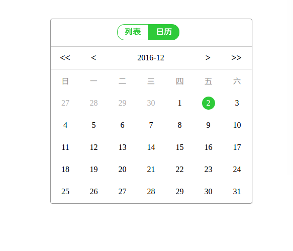

# Angular2-calender

This project was generated with [angular-cli](https://github.com/angular/angular-cli)

#### 

## Usage
- npm install angular-cli -g
- npm install
- npm start

## FeedBack
`li.zhixiang@live.cn`

## Further help

To get more help on the `angular-cli` use `ng --help` or go check out the [Angular-CLI README](https://github.com/angular/angular-cli/blob/master/README.md).
